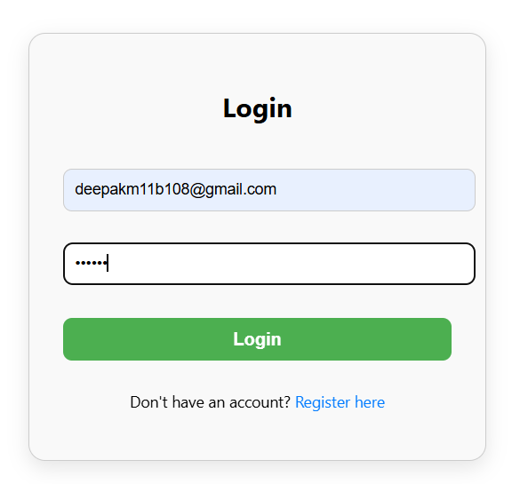
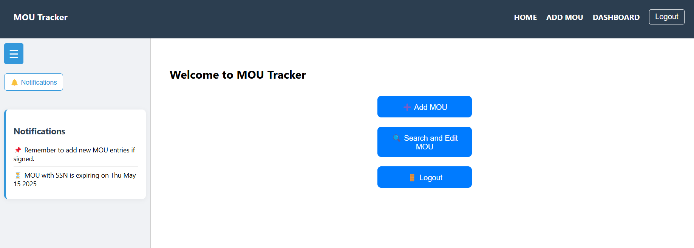
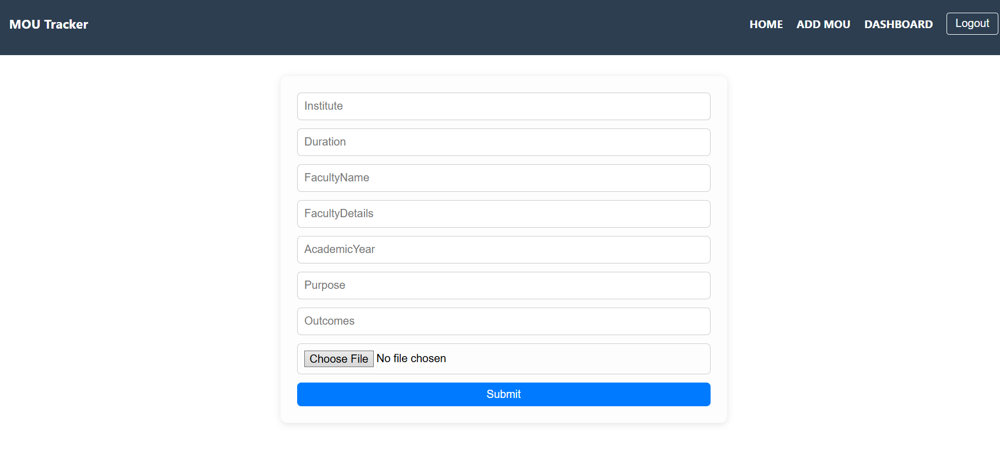
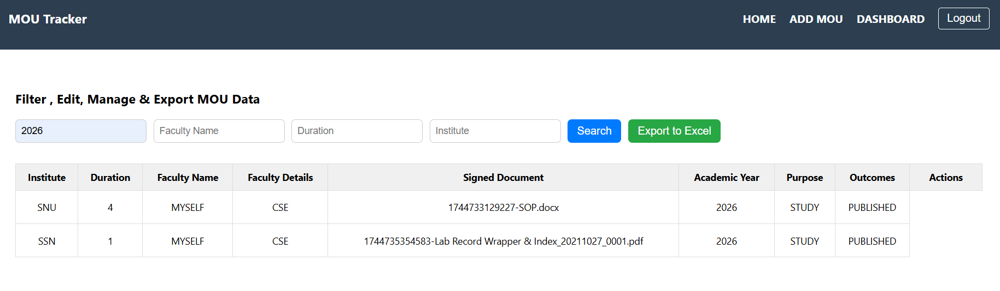

# 🤝 MOUTracker: Automated MOU Management System

MOUTracker is a full-stack web application designed to automate the management of Memorandums of Understanding (MOUs) between academic institutions and industry partners.

This system enables:
- 📥 Easy entry and editing of MOU details
- 🔍 Powerful filtering and Excel export
- 📅 Expiry tracking with reminders
- 📄 Upload of signed agreement files
- 📊 Notification panel with collapsible sidebar

> 🚫 No database needed! All data is stored in an Excel file (mou_data.xlsx)

---

## 📁 Project Structure

```
MOUTracker/
├── backend/
│   ├── routes/
│   │   └── mouRoutes.js
│   ├── utils/
│   │   └── excelHandler.js
│   ├── uploads/             # Stores uploaded signed MOU files
│   ├── mou_data.xlsx        # Excel file containing MOU data
│   └── server.js
├── frontend/
│   ├── src/
│   │   ├── components/      # React components
│   │   ├── styles/          # CSS files
│   │   ├── App.js
│   │   └── index.js
├── README.md
```

---

## 🚀 Setup Instructions

### 1. Clone the repository

```bash
https://github.com/Deeps-2005/MOUTracker.git
cd MOUTracker
```

---

### 2. Backend Setup

```bash
cd backend
npm install
mkdir uploads             # Create uploads folder to store files
node server.js            # Starts backend on http://localhost:5000
```

✔️ Make sure mou_data.xlsx exists, or it will be created on first form submission.

---

### 3. Frontend Setup

```bash
cd ../frontend
npm install
npm start                 # Runs frontend on http://localhost:3000
```

---

## 🌟 Features

- 🔐 User Login & Registration
- 📄 Add MOU with fields:
  - Institute, Faculty Name, Academic Year, Duration, Purpose, Outcomes, Signed Document
- 📥 File Upload: Store and track signed MOU files
- 🔍 Filter MOUs by Academic Year, Institute, Duration, Faculty
- 📤 Export to Excel
- ✏️ Edit / 🗑 Delete MOUs from table
- 🔔 Notification Panel:
  - Monthly reminders
  - Expiry notifications (based on AddedDate + Duration)
- ☰ Collapsible sidebar with toggleable menu

---

## 📦 Tech Stack

- Frontend: React, Axios, CSS
- Backend: Node.js, Express, XLSX, Multer
- Data Storage: Excel (.xlsx) instead of database

---

## 📬 Future Works: Email Notifications

(Optional) You can configure nodemailer to send email reminders for expiring MOUs.

---

## 📸 Screenshots






---

## 📄 License

This project is open-source and free to use.
