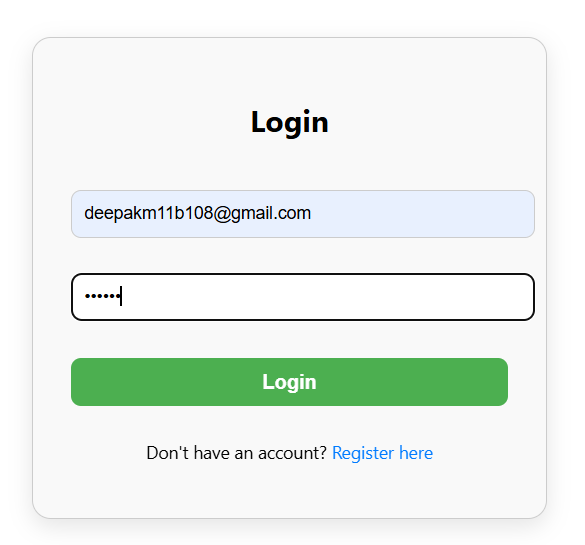
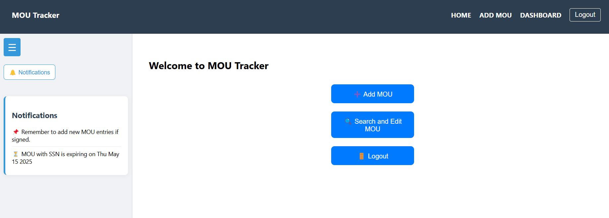
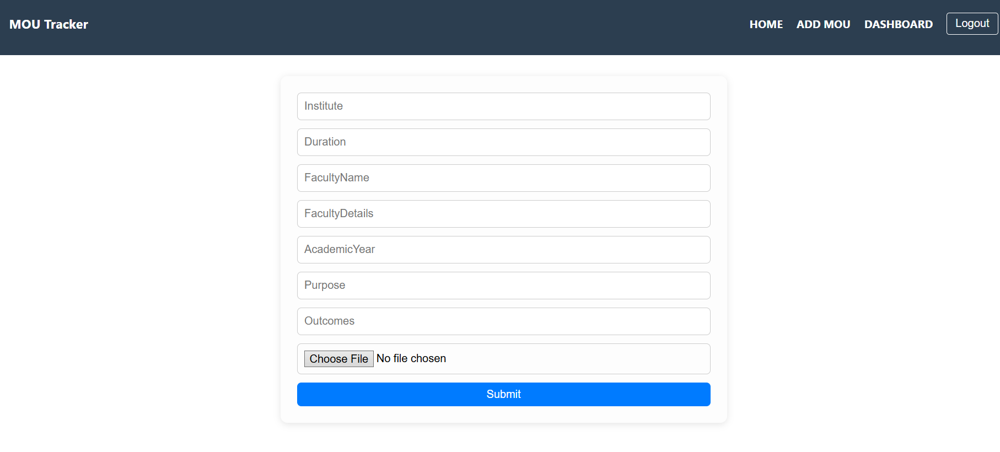
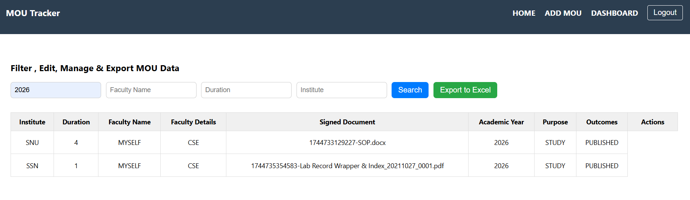

# MOUTracker - Automated MOU Management System

MOUTracker is a full-stack web application designed to streamline the management of Memorandums of Understanding (MOUs) between academic institutions and industry partners. The system provides a comprehensive solution for tracking, managing, and monitoring MOU lifecycles with automated notifications and reporting capabilities.

**Key Highlights:**
- Excel-based storage system (no database required)
- User authentication and authorization
- File upload and document management
- Automated expiry tracking and notifications
- Advanced filtering and Excel export functionality

---

## Key Features

### Authentication & Security
- **User Registration and Login:** Secure user authentication with JWT-based authorization
- **Protected Routes:** Role-based access control for different user levels
- **Password Encryption:** Bcrypt-hashed passwords for enhanced security

### MOU Management
- **Create MOUs:** Add new MOUs with comprehensive details including:
  - Institute name and contact information
  - Faculty/Department details
  - Academic year and duration
  - Purpose and expected outcomes
  - Signed document upload
- **Edit MOUs:** Update existing MOU information
- **Delete MOUs:** Remove outdated or incorrect entries
- **View Dashboard:** Comprehensive overview of all MOUs in a tabular format

### Document Management
- **File Upload:** Attach signed MOU documents (PDF, DOC, DOCX, etc.)
- **File Storage:** Secure storage in the backend uploads directory
- **File Retrieval:** Access uploaded documents when needed

### Filtering & Export
- **Advanced Filtering:** Filter MOUs by:
  - Academic Year
  - Institute Name
  - Duration
  - Faculty Name
- **Excel Export:** Download filtered MOU data as Excel files for reporting

### Notifications & Alerts
- **Expiry Tracking:** Automatic calculation of MOU expiry dates based on start date and duration
- **Notification Panel:** Collapsible sidebar showing:
  - Upcoming expiries (within 30 days)
  - Monthly MOU summary
  - Recently added MOUs
- **Visual Indicators:** Color-coded alerts for different notification types

---

## Tech Stack

### Frontend
- **React.js:** Component-based UI framework
- **React Router:** Client-side routing
- **Axios:** HTTP client for API requests
- **CSS3:** Custom styling for responsive design

### Backend
- **Node.js:** JavaScript runtime environment
- **Express.js:** Web application framework
- **JWT (jsonwebtoken):** Token-based authentication
- **Bcrypt:** Password hashing
- **Multer:** Middleware for handling file uploads
- **XLSX:** Excel file reading and writing
- **CORS:** Cross-origin resource sharing

### Data Storage
- **Excel (.xlsx):** Primary data storage for MOU records
- **JSON:** User credentials storage
- **File System:** Document storage in uploads directory

---

## Project Structure

```
MOUTracker/
├── backend/
│   ├── middleware/
│   │   ├── auth.js              # JWT authentication middleware
│   │   └── validation.js        # Input validation middleware
│   ├── routes/
│   │   └── mouRoutes.js         # API routes for MOU operations
│   ├── utils/
│   │   └── excelHandler.js      # Excel file read/write operations
│   ├── uploads/                 # Directory for uploaded MOU documents
│   ├── mou_data.xlsx            # Excel file storing MOU data
│   ├── users.json               # User credentials storage
│   ├── server.js                # Main server file
│   ├── package.json             # Backend dependencies
│   └── README.md                # Backend documentation
│
├── frontend/
│   ├── public/
│   │   ├── index.html           # HTML template
│   │   ├── manifest.json        # Web app manifest
│   │   └── robots.txt           # SEO configuration
│   ├── src/
│   │   ├── components/
│   │   │   ├── Dashboard.js     # MOU listing and management
│   │   │   ├── EditMOU.js       # Edit MOU form
│   │   │   ├── FilterDownload.js # Filter and export functionality
│   │   │   ├── Home.js          # Landing page
│   │   │   ├── Login.js         # User login form
│   │   │   ├── MOUForm.js       # Add new MOU form
│   │   │   ├── Navbar.js        # Navigation bar
│   │   │   ├── Notification.js  # Notification item component
│   │   │   ├── NotificationPanel.js # Notification sidebar
│   │   │   ├── ProtectedRoute.js # Route protection
│   │   │   └── Register.js      # User registration form
│   │   ├── styles/
│   │   │   ├── AuthForm.css     # Login/Register styling
│   │   │   ├── Dashboard.css    # Dashboard styling
│   │   │   ├── FilterDownload.css # Filter section styling
│   │   │   ├── Home.css         # Home page styling
│   │   │   ├── MOUForm.css      # Form styling
│   │   │   ├── Navbar.css       # Navigation styling
│   │   │   ├── NotificationPanel.css # Notification styling
│   │   │   └── Sidebar.css      # Sidebar styling
│   │   ├── utils/
│   │   │   └── api.js           # API service and axios configuration
│   │   ├── App.js               # Main application component
│   │   ├── App.css              # Global app styling
│   │   ├── index.js             # Application entry point
│   │   └── index.css            # Global CSS
│   ├── package.json             # Frontend dependencies
│   └── README.md                # Frontend documentation
│
├── README.md                    # Main project documentation
├── QUICK_START.md               # Quick start guide
├── IMPLEMENTATION_SUMMARY.md    # Implementation details
├── FRONTEND_INTEGRATION.md      # Frontend integration guide
├── FRONTEND_UPDATE_COMPLETE.md  # Frontend update notes
└── SECURITY_CHECKLIST.md        # Security best practices

```

---

## Setup Instructions

### Prerequisites

Ensure you have the following installed on your system:
- **Node.js** (v14 or higher)
- **npm** (v6 or higher)
- **Git** (for cloning the repository)

### Installation Steps

#### 1. Clone the Repository

```bash
git clone https://github.com/Deeps-2005/MOUTracker.git
cd MOUTracker
```

#### 2. Backend Setup

Navigate to the backend directory and install dependencies:

```bash
cd backend
npm install
```

Create the uploads directory for storing uploaded files:

```bash
mkdir uploads
```

The backend requires the following npm packages (already included in package.json):
- express
- cors
- multer
- xlsx
- jsonwebtoken
- bcryptjs

Start the backend server:

```bash
node server.js
```

The backend server will start on **http://localhost:5000**

**Note:** The `mou_data.xlsx` file will be automatically created when you add your first MOU.

#### 3. Frontend Setup

Open a new terminal, navigate to the frontend directory, and install dependencies:

```bash
cd frontend
npm install
```

The frontend requires the following npm packages (already included in package.json):
- react
- react-dom
- react-router-dom
- axios

Start the frontend development server:

```bash
npm start
```

The frontend application will open automatically in your browser at **http://localhost:3000**

#### 4. Access the Application

1. Open your browser and navigate to **http://localhost:3000**
2. Register a new user account
3. Login with your credentials
4. Start adding and managing MOUs

---

## API Endpoints

### Authentication
- `POST /api/register` - Register a new user
- `POST /api/login` - User login

### MOU Operations
- `GET /api/mous` - Get all MOUs
- `POST /api/mous` - Create a new MOU
- `PUT /api/mous/:id` - Update an existing MOU
- `DELETE /api/mous/:id` - Delete an MOU
- `POST /api/mous/export` - Export filtered MOUs to Excel

### File Operations
- `POST /api/upload` - Upload signed MOU document

---

## Configuration

### Backend Configuration

Key configuration settings in `server.js`:
- **Port:** 5000 (default)
- **JWT Secret:** Defined in environment or code
- **CORS:** Enabled for frontend origin

### Frontend Configuration

API base URL in `src/utils/api.js`:
- **Development:** http://localhost:5000
- **Production:** Update with your production API URL

---

## Usage Guide

1. **Register/Login:** Create an account or login with existing credentials
2. **Add MOU:** Click "Add MOU" and fill in the required details
3. **Upload Document:** Attach the signed MOU document
4. **View Dashboard:** See all MOUs in a sortable table
5. **Filter MOUs:** Use filters to find specific MOUs
6. **Export Data:** Download filtered results as Excel
7. **Edit/Delete:** Manage existing MOUs as needed
8. **Check Notifications:** View expiry alerts in the notification panel

---

## Future Enhancements

- Email notifications for expiring MOUs using Nodemailer
- Advanced analytics and reporting dashboard
- Multi-language support
- Database integration (MongoDB/PostgreSQL)
- Mobile application
- Automated MOU renewal workflows
- Integration with document signing services

---

## Screenshots







---

## License

This project is open-source and available for free use and modification.

---

## Support

For issues, questions, or contributions, please open an issue on the GitHub repository.
